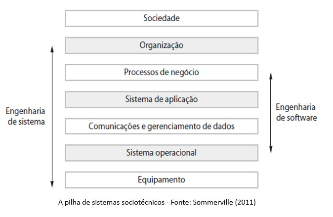

[Sistemas Críticos](#sistemas-críticos)

# Sistemas Críticos

As falhas de softwares podem ocorrer a qualquer momento e são  relativamente comuns -> na maioria dos casos, essas falhas causam inconveniências, mas não danos sérios.

Em alguns sistemas, certas **falhas** podem resultar em **danos mais sérios e significativos**, como: **perdas econômicas** ou **danos físicos**. 

Esse tipo de sistema dos quais as pessoas ou os negócios dependem são chamados de **Sistemas Críticos**. 

### Sistemas Críticos Tipos Principais

1. **Sistemas Críticos de Segurança**: a falha pode resultar em prejuízos, danos sérios ao meio ambiente e perda de vida humana. 
Exemplo: Sistema de Controle de uma Fábrica de Produtos Químicos, Sistemas Médicos.

2. **Sistemas Críticos de Missão**: a falha resulta em problemas de alguma atividade que possui metas. 
Exemplo: Sistema de Navegação de uma nave espacial.

3. **Sistemas Críticos de Negócios**: a falha resulta em custos altos as empresas que usam esse sistema. 
Exemplo: Sistema de Contabilidade, Sistema Bancário.

**Confiança** é a propriedade mais importante de um sistema crítico. 

Confiança é um termo que abrange os atributos: disponibilidade, confiabilidade, segurança e proteção.  

Para que a confiança seja a propriedade mais importante de um sistema crítico temos algumas razões:

- Os sistemas que não são confiáveis, seguros ou sem proteção são normalmente rejeitados pelos usuários.

- Os custos de falha nesses sistemas são muito altos.

- Os sistemas não confiáveis podem causar perda informações ou danos físicos aos seus usuários.

**Os sistemas de software não são sistemas isolados** -> são componentes essenciais de sistemas mais abrangentes com algum propósito humano, social ou organizacional. 

- **Exemplo**: o software de sistema de controle meteorológico no deserto controla os instrumentos em uma estação meteorológica ->  se comunica com outros sistemas de software (nacional e internacional mais amplos)  ->   sistemas incluem processos para a previsão do tempo, pessoas que operam o sistema e analisam seus resultados ->  incluem as organizações que dependem do sistema para ajudar na previsão do tempo para os indivíduos, governos, indústria etc. 

Esses sistemas mais amplos são chamados **Sistemas Sociotécnicos**. Eles incluem: elementos não técnicos (pessoas, processos, regulamentos, etc.) e componentes técnicos (computadores, software e outros equipamentos).

### Sistemas Sociotécnicos

Sistemas Sociotécnicos são tão complexos que é praticamente impossível entendê-los como um todo.  Para entender, o melhor é percebê-los como camadas:

A interação ocorre entre as camadas vizinhas, onde cada camada superior oculta os detalhes da camada inferior. 

Na prática, nem sempre é assim, pois pode haver interações inesperadas entre as camadas, o que pode ocasionar problemas para o sistema todo.

Exemplo: 
- Digamos que haja uma mudança na lei que regula o acesso às informações pessoais. 

- Essa alteração vem da **camada social** e leva à necessidade de novos procedimentos organizacionais e de mudanças nos **processos de negócios**.

- O **sistema de aplicação** pode não ser capaz de fornecer o nível de privacidade exigido para que as alterações sejam implementadas na **camada de comunicação** e **gerenciamento de dados**.

Os **Sistemas sociotécnicos** são sistemas corporativos destinados a contribuir para o cumprimento de uma meta de negócios. 

- **Exemplo de meta**: um aumento nas vendas (sistema de vendas), redução de materiais usados na indústria de manufatura, cálculos de arrecadação de impostos, manter um espaço aéreo seguro etc.

Fatores organizacionais do ambiente do sistema podem afetar os requisitos, o projeto e operação de um sistema sociotécnico, como:
 
**Mudanças de processos**: o sistema exige mudanças nos processos de trabalho do ambiente.

**Mudanças de trabalho**. novos sistemas podem desqualificar os usuários ou fazê-los mudar a forma como trabalham.

**Mudanças organizacionais**. o sistema pode alterar a estrutura do poder político em uma organização.

Os **sistemas sociotécnicos** possuem **três características importantes** com relação à proteção e confiança:

1. Possuem **propriedades emergentes** que são do sistema como um todo e não apenas a partes individuais do sistema. A *proteção* e a *confiança* fazem parte das propriedades emergentes do sistema.

2. Os sistemas sociotécnicos são **não determinísticos**, ou seja, quando apresentados a uma entrada específica, nem sempre produzem a mesma saída de dados. 

3. Os sistemas sociotécnicos **apoiam os objetivos organizacionais**, mas estes não dependem apenas do sistema. Eles podem depender da estabilidade, dos relacionamentos e conflitos entre os objetivos

- Exemplos de **Propriedades Emergentes** 

### Falhas do sistema

Nos sistemas críticos, quando ocorrem falhas, os custos são altíssimos e os erros costumam ser complexo, e muitas vezes, exige pessoas experientes que assumam o controle, para contornar as dificuldades, e com isso as falhas serem corrigidas ou minimizadas.

Em Sistemas Críticos, existem **três tipos de falhas** que podem ocorrer:
 
**Falhas de Hardware**: erros de fabricação, final de sua vida útil.

**Falhas de Software**: enganos na especificação, projeto ou implementação.

**Falhas Operacionais**: falha ao operar o sistema.

Vamos considerar a *confiabilidade* a partir de **três perspectivas** em sistemas sociotécnicos:

As falhas podem ser propagadas para os demais níveis do sistema, pois a confiabilidade de hardware, de software e de operador não são independentes. 

### Confiança e Proteção

Os sistemas de software são tão importantes para os negócios das empresas e das pessoas -> é essencial que ele seja **confiável** e que esteja **disponível** quando necessário e que **funcione corretamente**. 

A **confiança de um sistema de computador** é uma propriedade do sistema que reflete sua fidedignidade.

- **Fidedignidade**: significa, essencialmente, o grau de confiança de um usuário no funcionamento esperado pelo sistema, no fato de que o sistema não ‘falhará’ em condições normais de uso”. 

A confiança não é expressa numericamente. Usamos **termos relativos**, como: ‘não confiável’, ‘muito confiável’ e ‘ultraconfiável’ para expressar o grau de confiança que podemos ter em um sistema de software.

Há **quatro dimensões** principais da **confiança**:

Principais propriedades da confiança:  a confiabilidade de um sistema vai depender do contexto em que ele for usado.  

Para desenvolver um **software confiável**, você precisa garantir que:

1. Evitar a introdução de erros acidentais no sistema durante a especificação e o desenvolvimento de software.

2. Projetar processos de verificação e validação, eficazes na descoberta de erros residuais que afetam a confiança do sistema.

3. Projetar mecanismos de proteção contra ataques externos capazes de comprometer a disponibilidade ou a proteção do sistema.

4. O sistema implantado e seu software de suporte sejam configurados corretamente para seu ambiente operacional. 

5. Incluir mecanismos de recuperação que tornem possível a restauração do serviço normal do sistema o mais rapidamente possível. 

