[Sistemas Críticos](#sistemas-críticos)

[Engenharia de Segurança](#engenharia-de-segurança)

[Reengenharia e Manutenção de Software](#reengenharia-e-manutenção-de-software)

# Sistemas Críticos

As falhas de softwares podem ocorrer a qualquer momento e são  relativamente comuns -> na maioria dos casos, essas falhas causam inconveniências, mas não danos sérios.

Em alguns sistemas, certas **falhas** podem resultar em **danos mais sérios e significativos**, como: **perdas econômicas** ou **danos físicos**. 

Esse tipo de sistema dos quais as pessoas ou os negócios dependem são chamados de **Sistemas Críticos**. 

### Sistemas Críticos Tipos Principais

1. **Sistemas Críticos de Segurança**: a falha pode resultar em prejuízos, danos sérios ao meio ambiente e perda de vida humana. 
Exemplo: Sistema de Controle de uma Fábrica de Produtos Químicos, Sistemas Médicos.

2. **Sistemas Críticos de Missão**: a falha resulta em problemas de alguma atividade que possui metas. 
Exemplo: Sistema de Navegação de uma nave espacial.

3. **Sistemas Críticos de Negócios**: a falha resulta em custos altos as empresas que usam esse sistema. 
Exemplo: Sistema de Contabilidade, Sistema Bancário.

**Confiança** é a propriedade mais importante de um sistema crítico. 

Confiança é um termo que abrange os atributos: disponibilidade, confiabilidade, segurança e proteção.  

Para que a confiança seja a propriedade mais importante de um sistema crítico temos algumas razões:

- Os sistemas que não são confiáveis, seguros ou sem proteção são normalmente rejeitados pelos usuários.

- Os custos de falha nesses sistemas são muito altos.

- Os sistemas não confiáveis podem causar perda informações ou danos físicos aos seus usuários.

**Os sistemas de software não são sistemas isolados** -> são componentes essenciais de sistemas mais abrangentes com algum propósito humano, social ou organizacional. 

- **Exemplo**: o software de sistema de controle meteorológico no deserto controla os instrumentos em uma estação meteorológica ->  se comunica com outros sistemas de software (nacional e internacional mais amplos)  ->   sistemas incluem processos para a previsão do tempo, pessoas que operam o sistema e analisam seus resultados ->  incluem as organizações que dependem do sistema para ajudar na previsão do tempo para os indivíduos, governos, indústria etc. 

Esses sistemas mais amplos são chamados **Sistemas Sociotécnicos**. Eles incluem: elementos não técnicos (pessoas, processos, regulamentos, etc.) e componentes técnicos (computadores, software e outros equipamentos).

### Sistemas Sociotécnicos

Sistemas Sociotécnicos são tão complexos que é praticamente impossível entendê-los como um todo.  Para entender, o melhor é percebê-los como camadas:

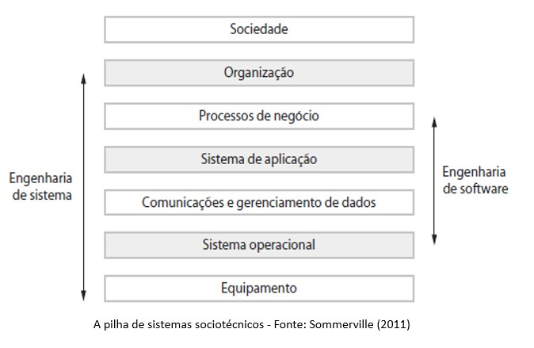

A interação ocorre entre as camadas vizinhas, onde cada camada superior oculta os detalhes da camada inferior. 

Na prática, nem sempre é assim, pois pode haver interações inesperadas entre as camadas, o que pode ocasionar problemas para o sistema todo.

Exemplo: 
- Digamos que haja uma mudança na lei que regula o acesso às informações pessoais. 

- Essa alteração vem da **camada social** e leva à necessidade de novos procedimentos organizacionais e de mudanças nos **processos de negócios**.

- O **sistema de aplicação** pode não ser capaz de fornecer o nível de privacidade exigido para que as alterações sejam implementadas na **camada de comunicação** e **gerenciamento de dados**.

Os **Sistemas sociotécnicos** são sistemas corporativos destinados a contribuir para o cumprimento de uma meta de negócios. 

- **Exemplo de meta**: um aumento nas vendas (sistema de vendas), redução de materiais usados na indústria de manufatura, cálculos de arrecadação de impostos, manter um espaço aéreo seguro etc.

Fatores organizacionais do ambiente do sistema podem afetar os requisitos, o projeto e operação de um sistema sociotécnico, como:
 
**Mudanças de processos**: o sistema exige mudanças nos processos de trabalho do ambiente.

**Mudanças de trabalho**. novos sistemas podem desqualificar os usuários ou fazê-los mudar a forma como trabalham.

**Mudanças organizacionais**. o sistema pode alterar a estrutura do poder político em uma organização.

Os **sistemas sociotécnicos** possuem **três características importantes** com relação à proteção e confiança:

1. Possuem **propriedades emergentes** que são do sistema como um todo e não apenas a partes individuais do sistema. A *proteção* e a *confiança* fazem parte das propriedades emergentes do sistema.

2. Os sistemas sociotécnicos são **não determinísticos**, ou seja, quando apresentados a uma entrada específica, nem sempre produzem a mesma saída de dados. 

3. Os sistemas sociotécnicos **apoiam os objetivos organizacionais**, mas estes não dependem apenas do sistema. Eles podem depender da estabilidade, dos relacionamentos e conflitos entre os objetivos

- Exemplos de **Propriedades Emergentes** 

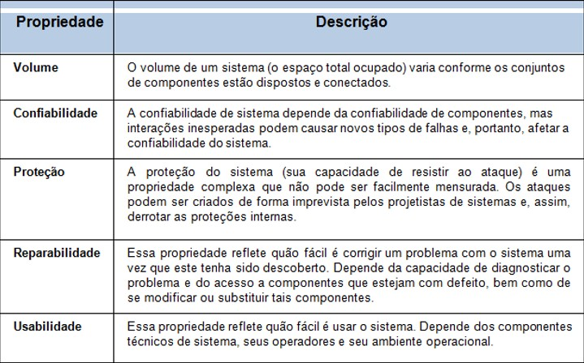

### Falhas do sistema

Nos sistemas críticos, quando ocorrem falhas, os custos são altíssimos e os erros costumam ser complexo, e muitas vezes, exige pessoas experientes que assumam o controle, para contornar as dificuldades, e com isso as falhas serem corrigidas ou minimizadas.

Em Sistemas Críticos, existem **três tipos de falhas** que podem ocorrer:
 
**Falhas de Hardware**: erros de fabricação, final de sua vida útil.

**Falhas de Software**: enganos na especificação, projeto ou implementação.

**Falhas Operacionais**: falha ao operar o sistema.

Vamos considerar a *confiabilidade* a partir de **três perspectivas** em sistemas sociotécnicos:

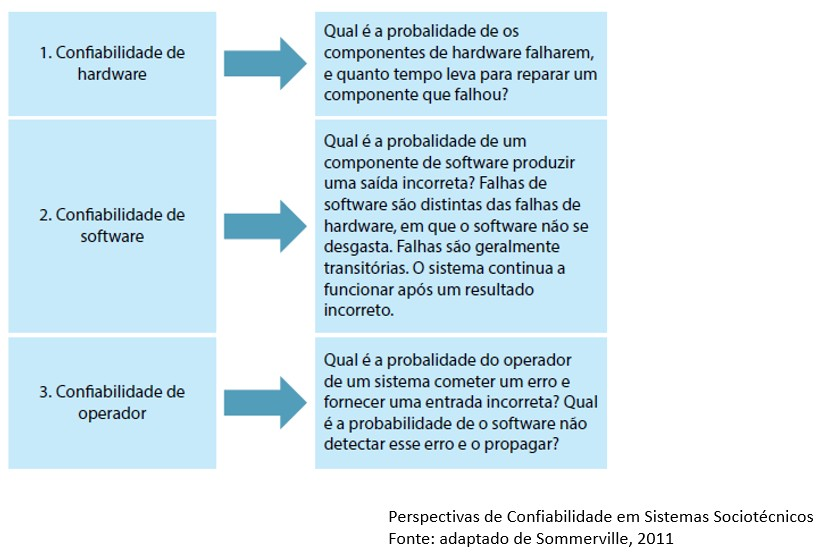

As falhas podem ser propagadas para os demais níveis do sistema, pois a confiabilidade de hardware, de software e de operador não são independentes. 

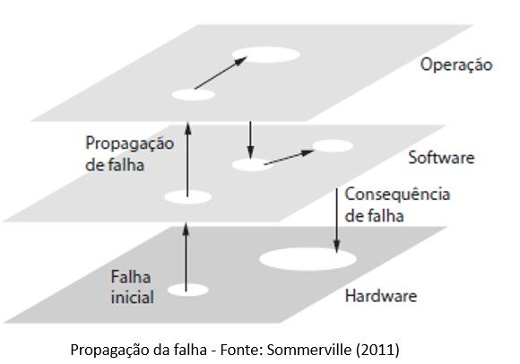

### Confiança e Proteção

Os sistemas de software são tão importantes para os negócios das empresas e das pessoas -> é essencial que ele seja **confiável** e que esteja **disponível** quando necessário e que **funcione corretamente**. 

A **confiança de um sistema de computador** é uma propriedade do sistema que reflete sua fidedignidade.

- **Fidedignidade**: significa, essencialmente, o grau de confiança de um usuário no funcionamento esperado pelo sistema, no fato de que o sistema não ‘falhará’ em condições normais de uso”. 

A confiança não é expressa numericamente. Usamos **termos relativos**, como: ‘não confiável’, ‘muito confiável’ e ‘ultraconfiável’ para expressar o grau de confiança que podemos ter em um sistema de software.

Há **quatro dimensões** principais da **confiança**:

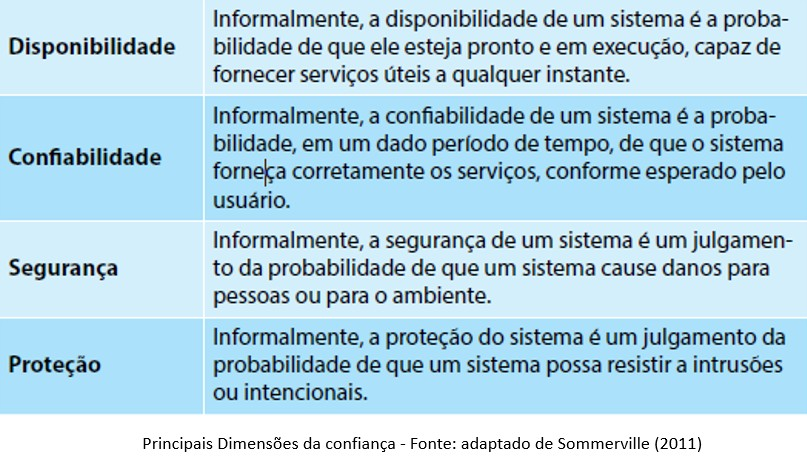

Principais propriedades da confiança:  a confiabilidade de um sistema vai depender do contexto em que ele for usado.  

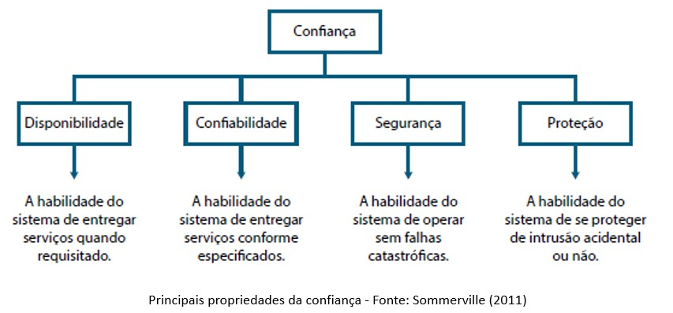

Para desenvolver um **software confiável**, você precisa garantir que:

1. Evitar a introdução de erros acidentais no sistema durante a especificação e o desenvolvimento de software.

2. Projetar processos de verificação e validação, eficazes na descoberta de erros residuais que afetam a confiança do sistema.

3. Projetar mecanismos de proteção contra ataques externos capazes de comprometer a disponibilidade ou a proteção do sistema.

4. O sistema implantado e seu software de suporte sejam configurados corretamente para seu ambiente operacional. 

5. Incluir mecanismos de recuperação que tornem possível a restauração do serviço normal do sistema o mais rapidamente possível. 

# [👆 TÓPICOS](#tópicos)

# Engenharia de Segurança

Será que existe algum sistema de software que seja **seguro**? 

Muitos softwares que usamos enfrentam **ameaças** o tempo todo, desde aplicativos para internet até sistemas complexos. 

**Engenheiros de software** devem conhecer essas ameaças para que consigam ter a capacidade de proteger os sistemas que desenvolvem.

As **ameaças** existem há mais de uma década e estão se multiplicando com: 

- Crescimento da Web

- Ubiquidade dos aplicativos móveis 

- Uso da nuvem. 

O uso dessas tecnologias vem gerando novas preocupações sobre a segurança com relação a:

- Privacidade dos usuários

- Perdas ou roubo de informações pessoais e empresariais.

- **Segurança**: deve ser uma preocupação de qualquer engenheiro de software que tenha recursos dos clientes para proteger. 

- A **segurança de software** fornece os mecanismos que permitem a um sistema de software proteger seus ativos contra ataques. 

- **Ativos**: são *recursos de sistema* que tem valor para um ou mais envolvidos. Os ativos incluem: informações de banco de dados, arquivos, programas, espaço de armazenamento no disco rígido, memória de sistema ou até mesmo capacidade de processador. 

- **Segurança**: considerada um dos **aspectos importantes** da garantia da **qualidade** do software. 

Quanto mais relatos de erros: mais difícil fica considerar que o sistema tem qualidade ou que seja possível aumentar a qualidade. 

**Fica difícil aumentar a segurança com relatos de vulnerabilidade no sistema**. 

- **Segurança**: considerar desde o início do processo de desenvolvimento do software. Deve ser incorporada nas fases iniciais do projeto, na implementação e verificada durante os testes e na implantação.

### Análise dos Requisitos de Segurança
         	
- Deve ser determinada junto com o cliente os **requisitos de segurança**:  identificar os ativos que devem ser protegidos, e, em caso de perda desses ativos, qual o custo associado a cada um. 

- O **valor da perda de um ativo** é conhecido como sua **exposição**. 

Durante a construção do software é importante: 

Pensar em antecipar as **condições** ou **ameaças** que possam vir a causar uma perda que possam danificar o sistema ou torná-lo inacessível aos usuários. 

Esse processo de antecipação é chamado de **Análise de Ameaça**. 

Depois de identificados as ameaças e vulnerabilidades do sistema, é necessário que sejam criados **controles para evitar estes ataques** e **mitigar seus danos** e possíveis **perdas**.

Para a **Análise da Engenharia de Segurança** temos algumas tarefas que devem ser pensadas. 

1. **Levantamento de Requisitos de Segurança**:  utiliza as técnicas gerais de levantamento de requisitos e são aplicadas ao levantamento de requisitos de segurança. 

2. **Modelagem de Segurança**: é onde é feita uma descrição formal da política de segurança do sistema baseado nas informações do levantamento de requisitos de segurança. A política de segurança descreve os principais requisitos de segurança e contém regras que descrevem como a segurança será imposta.

3. **Projeto de Medidas**: tarefa onde as métricas e medidas de segurança precisam ser encontradas na avaliação das propriedades:
 
- *Confiabilidade*: funcionar sob condições hostis.

- *Credibilidade*: o sistema não se comporta de forma mal-intencionada.

- *Capacidade de sobrevivência*: continua a funcionar mesmo estando comprometido.

4. **Verificações de Exatidão**: tarefa que precisa ocorrer ao longo do ciclo de desenvolvimento do software.  

- No início do processo de desenvolvimento devemos determinar qual a **exposição de ativos envolvidos** nos ataques contra vulnerabilidade do sistema. 

- Muitas das verificações de segurança devem ser incluídas nas tarefas da Engenharia de Software convencional como nas auditorias, inspeções e atividades de teste.

### Análise de Risco de Segurança
 
Fazem parte do planejamento do projeto as tarefas de **identificar** e **gerenciar riscos de segurança**. 

- **Modelagem de ameaças**:  é um método de análise de segurança usado para identificar ameaças com o potencial mais alto de causar danos a um sistema baseado em software. 

- A modelagem de ameaças é realizada nas fases iniciais  do projeto, usando as informações do levantamento de requisitos e os modelos de análise. 

Para criar um **modelo de ameaças** é necessário:

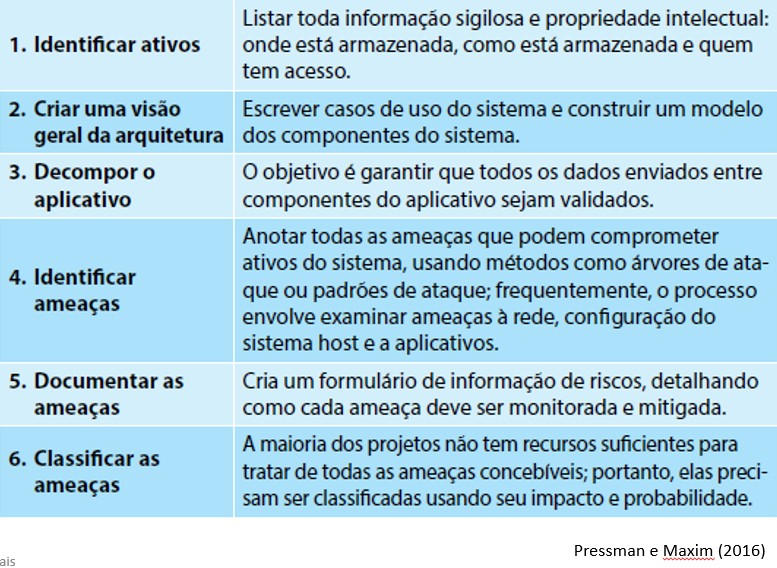

A **preocupação da Engenharia de Segurança** de software é com:

- O desenvolvimento de software deve **proteger contra ameaças** os ativos que gerencia. 

- **Gestão de riscos à segurança**:  se preocupar com  a avaliação do impacto de possíveis ameaças e com a produção de requisitos de segurança para minimizar perdas críticas.

- O **projeto** voltado **a segurança** deve envolver a criação de uma arquitetura de sistemas que minimiza a introdução de vulnerabilidades conhecidas. 

Os **engenheiros de software** devem utilizar técnicas para evitar, repelir e recuperar de ataques, como uma maneira de mitigar os efeitos de perdas .

# [👆 TÓPICOS](#tópicos)

# Reengenharia e Manutenção de Software

Com tantas correções de bugs, solicitações de adaptações e melhorias, que devemos pensar em enfrentar o desafio da **manutenção do software**.

Outro problema é a **mobilidade dos profissionais**:  

• Os  desenvolvedores do código original talvez não esteja mais na empresa.
• Ou outros desenvolvedores tenham modificado o sistema e já se foram.
• Ou pode não ter restado ninguém na empresa que tenha conhecimento direto do sistema legado. 

A **evolução do sistema** envolve a compreensão e o conhecimento do programa que tem que ser mudado, para a implementação de novas mudanças. 

Mas muitos sistemas legados são velhos, difíceis de serem mudados.

Ao longo do tempo, a estrutura inicialmente projetada do sistema pode:
    Não ser mais suportada ou pode ter sido danificada por várias mudanças durante o seu ciclo de vida.

Para que os **sistemas legados** sejam mais fáceis para serem mantidos  é preciso: **melhorar** a sua **estrutura** e sua **inteligibilidade** aplicando a **Reengenharia**.

A **Reengenharia** pode envolver: 

- A redocumentação de sistema

- A refatoração da arquitetura de sistema

- A mudança de linguagem de programação para uma linguagem moderna (modificações e atualizações da estrutura e dos dados de sistema)

- A funcionalidade de software não é alterada (evitar grandes mudanças na arquitetura de sistema).

Benefícios que são considerados importantes na Reengenharia:

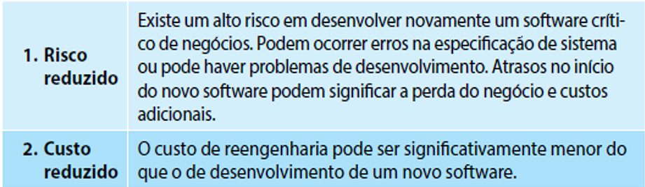

## Modelo geral de processo de Reengenharia:  

Entrada para o processo é um programa legado (programa original)

Saída é uma versão melhorada e reestruturada do mesmo programa (dados reconstruídos). 

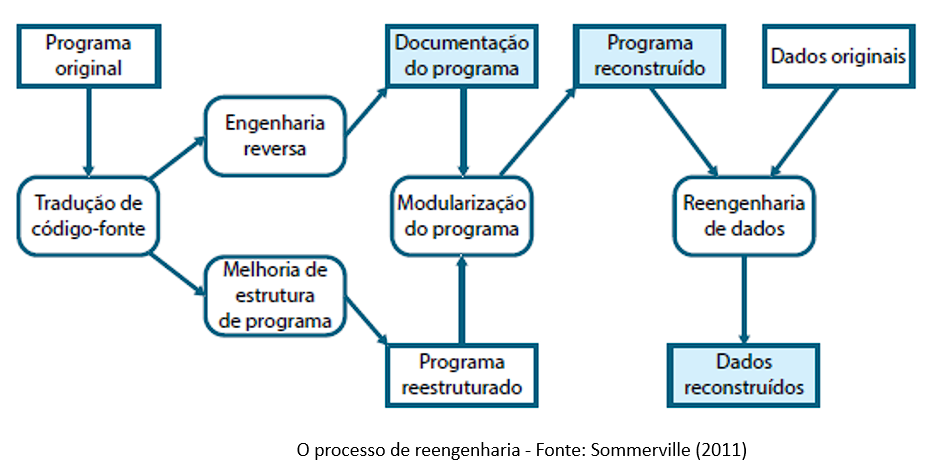

O **processo de Reengenharia** tem as seguintes atividades:
 
1. **Tradução de código-fonte**: onde é utilizada uma ferramenta de tradução. O programa é convertido para uma versão mais moderna. 

2. **Engenharia Reversa**: onde o programa é analisado para extrair informações sobre ele. Esse processo pode ser automatizado.

3. **Melhoria de estrutura de programa**: onde a estrutura de controle do programa é analisada e pode ser modificada caso seja necessário. 

4. **Modularização de programa**: atividade onde as partes relacionadas do programa são agrupadas, se tiver redundância, poderá ser removida. 

5. **Reengenharia de dados**: atividade onde os dados processados pelo programa são alterados para que reflitam as mudanças do programa. 

Dependendo da extensão do trabalho -> custos da reengenharia podem aumentar. 

Espectro de possíveis abordagens para a **Reengenharia**: 

custos aumentam da esquerda para a direita

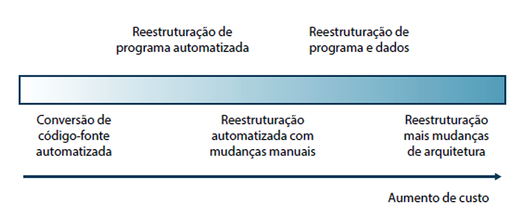

Atividades de Reengenharia de Software

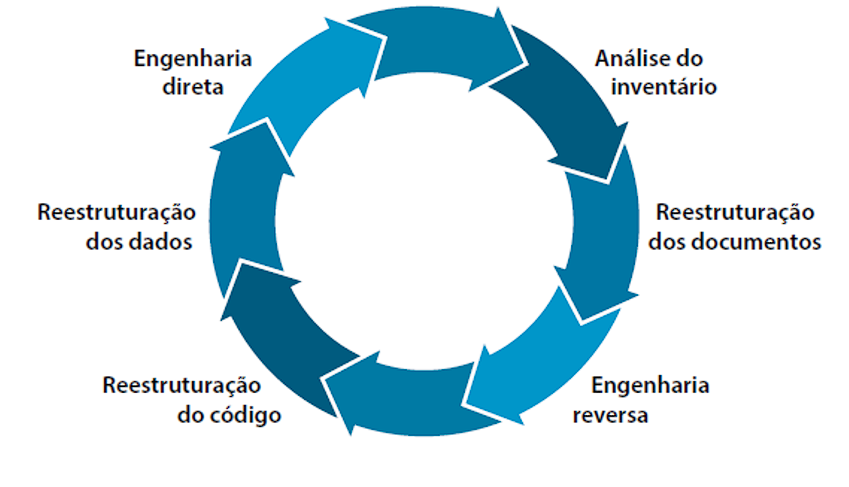

## Manutenção de Software

O **software continuará** evoluindo com o passar do tempo, independentemente do domínio de aplicação, tamanho ou da sua complexidade. 

**Processo de evolução**: dirigido pelas mudanças que ocorrem no software quando:

- Ocorrem alterações
  
- Erros são corrigidos
  
- Há adaptação a um novo ambiente ou tecnologia
  
- Solicitações de novas funcionalidades pelo cliente
  
- Novas regras de negócio exigidas pelo governo 
  
- Quando o sistema passa por um processo de **Reengenharia**.

- A **manutenção** começa quase imediatamente. 

- O software é liberado para os usuários finais: os relatos de bugs começam a chegar em alguns dias. 

- Em algumas semanas: uma classe de usuários indica que o software deve ser mudado para se adaptar às necessidades especiais de seus ambientes.

- Em alguns meses:  outro grupo corporativo, ainda não interessado no software quando foi lançado, agora reconhece que pode lhes trazer alguns benefícios. 

**Eles precisarão de algumas melhorias para fazer o software funcionar em seu mundo** 

### Razões para a Manutenção de Sistema:

Muitos softwares que usamos hoje e dependemos, possuem em média de 10 a 15 anos. Esses sistemas, quando foram desenvolvidos, usaram na época as melhores técnicas de projeto e codificação conhecidas. 

A arquitetura geral do sistema não teve uma grande atenção. Como resultado:
Estruturas mal projetadas, mal codificadas, de lógica pobre e mal documentadas e que exigem muitos chamados para corrigir falhas e inconsistência a fim de mantê-los rodando. 

Mobilidade dos profissionais

### Manutenção de software

Processo geral de mudança em um sistema depois que ele é liberado para uso. 

Se aplica ao software customizado em que grupos de desenvolvimento separados estão envolvidos antes e depois da liberação. 

Alterações feitas no software podem ser: 
Simples mudanças para correção de erros de codificação,  mudanças mais extensas para correção de erros de projeto, ou melhorias significativas. 

- Existem três diferentes tipos de Manutenção de Software:

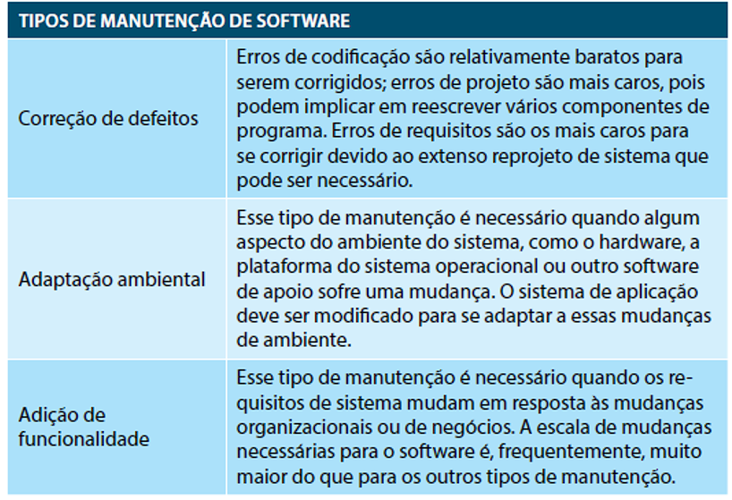

Tipos de Manutenção 

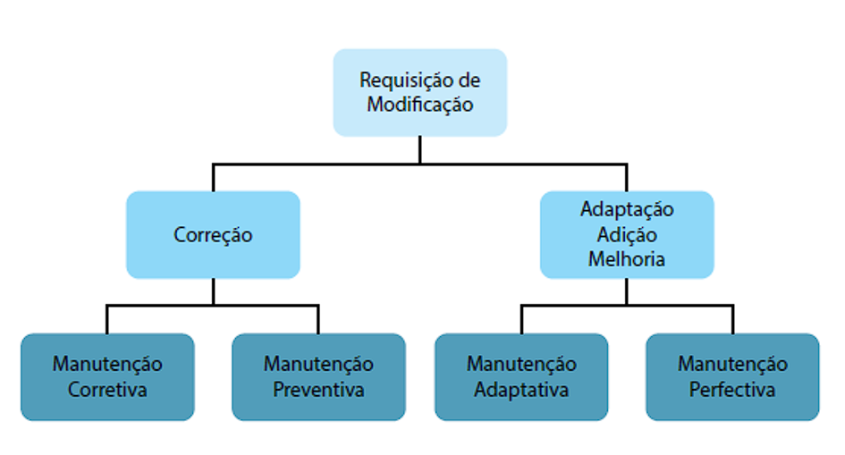

**Manutenibilidade**:  é o software “manutenível” que apresenta uma modularidade eficaz, faz uso de padrões de projeto, construído usando padrões e convenções de codificação que sejam bem definidos e que levam a um código-fonte auto documentado e inteligível. 

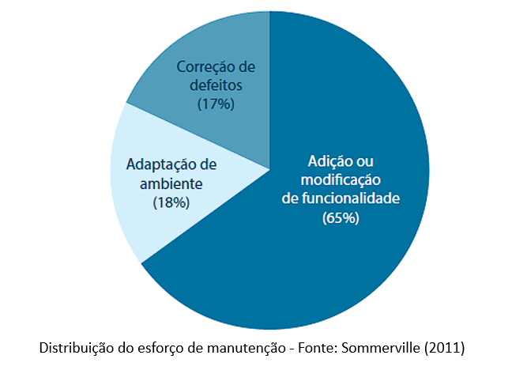

É mais **caro adicionar funcionalidade depois** que um software está em uso do que implementar a mesma funcionalidade durante o seu desenvolvimento.
A razões para isso são:
 
1. **Estabilidade da equipe**: após o sistema ter sido liberado para uso do cliente, muitas vezes a equipe de desenvolvimento é desmobilizada e remanejada para novos projetos. 
   
2. **Más práticas de desenvolvimento**: em muitos casos, o contrato para a manutenção de um sistema é separado do contrato de desenvolvimento do sistema.

3. **Qualificações de pessoal**: em geral, a equipe de manutenção é inexperiente e não domina a regra de negócio da aplicação. 
   
4. **Idade do programa e estrutura**: muitas vezes, o sistema sobre muitas alterações e com isso a sua estrutura tende a degradar e envelhecer, tornando-se cada vez mais difíceis de serem entendidos e alterados. 

# [👆 TÓPICOS](#tópicos)

 

