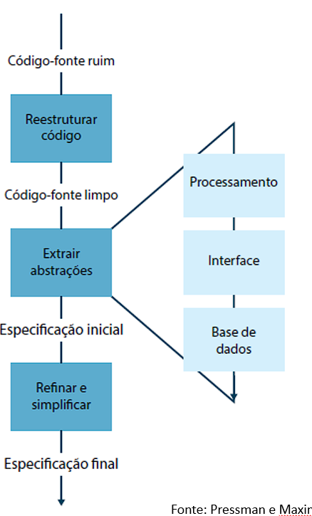
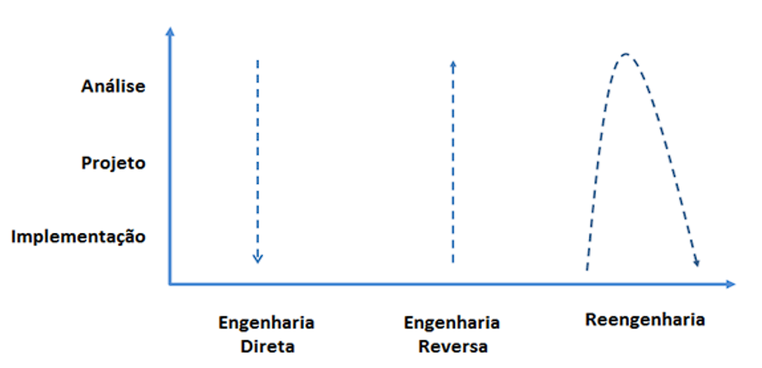

# Engenharia Reversa

O termo **Engenharia Reversa** tem suas origens no mundo do hardware. 

Uma empresa desmonta um produto de hardware competitivo na tentativa de conhecer os “segredos” de projeto e fabricação do concorrente. 

Os segredos poderiam ser facilmente entendidos se fosse possível obter as especificações de projeto e fabricação do concorrente. 

Mas esses documentos são de propriedade privada e não estão disponíveis para a empresa que está fazendo a engenharia reversa. 

**Engenharia Reversa** bem-sucedida resulta em uma ou mais especificações de projeto e fabricação para um produto pelo exame de amostras atuais do produto. **A Engenharia Reversa para o software é bem similar.**

**Engenharia Reversa para o software**:  sistema a ser submetido a uma engenharia reversa **não é o sistema de um concorrente**. 

Ela é aplicada no **próprio sistema da empresa** que em geral, foi desenvolvimento há muitos anos. 

O **conceito de Engenharia de Reversa** para o software: 

Processo para analisar um programa na tentativa de criar uma representação do programa em um nível mais alto de abstração do que o código-fonte

**Engenharia Reversa** é um processo de **recuperação do projeto**, onde as **ferramentas extraem informações** do projeto de dados, da arquitetura e procedural com base em um programa já desenvolvido.

Informações que podem ser extraídas pela Engenharia Reversa:

- Nível de abstração

- Completeza

- Interatividade

- Direcionalidade

Para entendermos a Engenharia Reversa dos dados, vamos conhecer os níveis onde ela ocorre: 

**Nível de abstração**: a engenharia reversa dos dados ocorre em diferentes níveis de abstração e normalmente é a primeira tarefa da reengenharia.

**Nível de programa**: as estruturas internas de dados de programa devem passar por uma engenharia reversa como parte de um trabalho de reengenharia total.

**Nível de sistema**: as estruturas de dados globais (por exemplo, arquivos, bases de dados) passam por uma reengenharia para acomodar novos paradigmas de gerenciamento de base de dados.

**Estruturas internas de dados**:

- Técnicas de Engenharia Reversa para dados internos de programa destacam a definição de classes de objetos. 

- O código do programa é examinado para agrupar variáveis de programa relacionadas. A organização de dados dentro do código pode identificar tipos de dados abstratos. 

**Estrutura de base de dados**:

- Permite a definição de objetos de dados

- O uso de algum método que estabeleça relações entre esses objetos, independentemente de sua organização lógica e estrutura física. 

**Engenharia reversa para entender o processamento:**

- Começa com uma tentativa de entender e extrair abstrações procedurais representadas pelo código-fonte.

Para entender as **abstrações procedurais** é analisado o código-fonte nos seguintes níveis de abstrações: 

- Sistema

- Programa

- Componente

- Padrão

- Instruções

**Engenharia Reversa das interfaces de usuário**

As interfaces de usuários sofisticadas tornaram-se uma **exigência** para sistemas de todos os tipos baseados em computadores, e por isso, tornou-se uma das atividades mais comuns de Reengenharia. 

Antes de recriar uma interface de usuário deverá ocorrer:
- Engenharia Reversa. 

Para entender completamente uma interface de usuário deve:
- Especificar a estrutura e o comportamento da interface. 

Demonstrativo entre as Engenharias:

A Reengenharia de Software abrange uma série de atividades: 

- Análise

- Reestruturação da documentação

- Engenharia Reversa

- Reestruturação de programas e dados 

- Engenharia Direta. 

