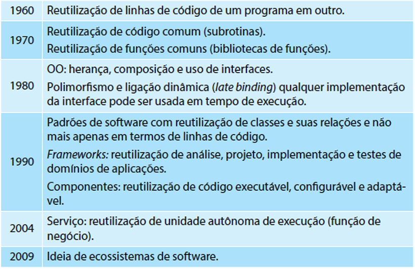
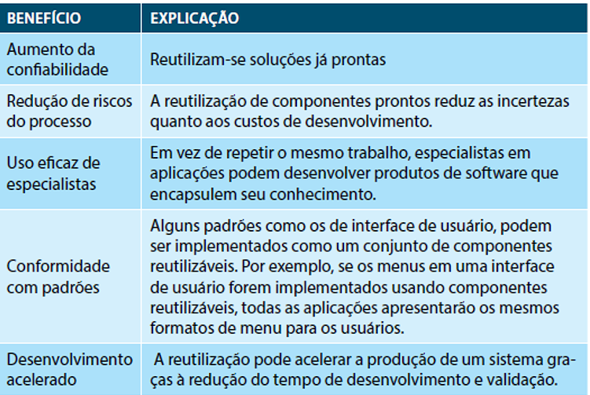
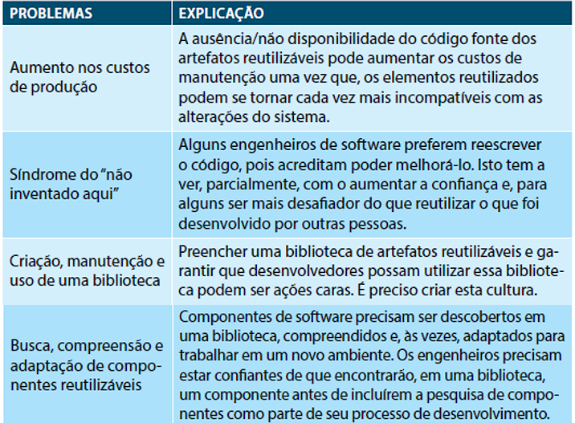
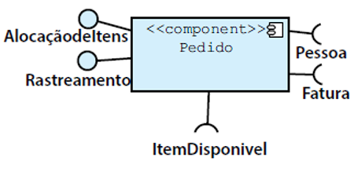
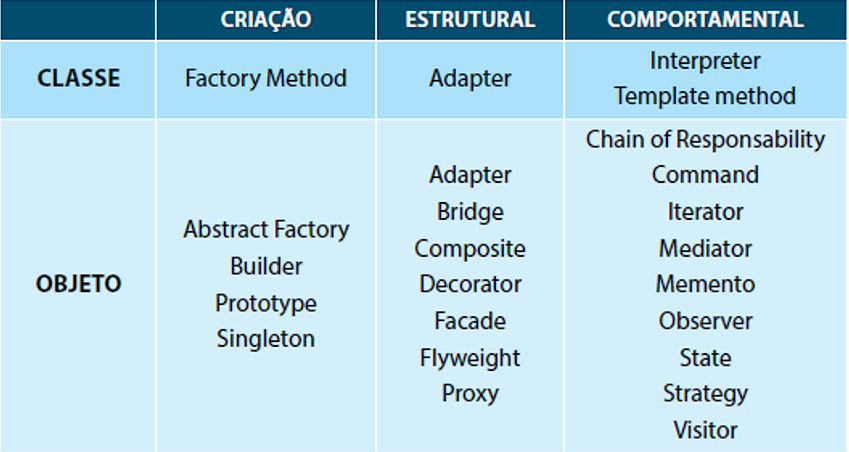

# Engenharia Reversa

O termo **Engenharia Reversa** tem suas origens no mundo do hardware. 

Uma empresa desmonta um produto de hardware competitivo na tentativa de conhecer os “segredos” de projeto e fabricação do concorrente. 

Os segredos poderiam ser facilmente entendidos se fosse possível obter as especificações de projeto e fabricação do concorrente. 

Mas esses documentos são de propriedade privada e não estão disponíveis para a empresa que está fazendo a engenharia reversa. 

**Engenharia Reversa** bem-sucedida resulta em uma ou mais especificações de projeto e fabricação para um produto pelo exame de amostras atuais do produto. **A Engenharia Reversa para o software é bem similar.**

**Engenharia Reversa para o software**:  sistema a ser submetido a uma engenharia reversa **não é o sistema de um concorrente**. 

Ela é aplicada no **próprio sistema da empresa** que em geral, foi desenvolvimento há muitos anos. 

O **conceito de Engenharia de Reversa** para o software: 

Processo para analisar um programa na tentativa de criar uma representação do programa em um nível mais alto de abstração do que o código-fonte

**Engenharia Reversa** é um processo de **recuperação do projeto**, onde as **ferramentas extraem informações** do projeto de dados, da arquitetura e procedural com base em um programa já desenvolvido.

Informações que podem ser extraídas pela Engenharia Reversa:

- Nível de abstração

- Completeza

- Interatividade

- Direcionalidade

Para entendermos a Engenharia Reversa dos dados, vamos conhecer os níveis onde ela ocorre: 

**Nível de abstração**: a engenharia reversa dos dados ocorre em diferentes níveis de abstração e normalmente é a primeira tarefa da reengenharia.

**Nível de programa**: as estruturas internas de dados de programa devem passar por uma engenharia reversa como parte de um trabalho de reengenharia total.

**Nível de sistema**: as estruturas de dados globais (por exemplo, arquivos, bases de dados) passam por uma reengenharia para acomodar novos paradigmas de gerenciamento de base de dados.

**Estruturas internas de dados**:

- Técnicas de Engenharia Reversa para dados internos de programa destacam a definição de classes de objetos. 

- O código do programa é examinado para agrupar variáveis de programa relacionadas. A organização de dados dentro do código pode identificar tipos de dados abstratos. 

**Estrutura de base de dados**:

- Permite a definição de objetos de dados

- O uso de algum método que estabeleça relações entre esses objetos, independentemente de sua organização lógica e estrutura física. 

**Engenharia reversa para entender o processamento:**

- Começa com uma tentativa de entender e extrair abstrações procedurais representadas pelo código-fonte.

Para entender as **abstrações procedurais** é analisado o código-fonte nos seguintes níveis de abstrações: 

- Sistema

- Programa

- Componente

- Padrão

- Instruções

**Engenharia Reversa das interfaces de usuário**

As interfaces de usuários sofisticadas tornaram-se uma **exigência** para sistemas de todos os tipos baseados em computadores, e por isso, tornou-se uma das atividades mais comuns de Reengenharia. 

Antes de recriar uma interface de usuário deverá ocorrer:
- Engenharia Reversa. 

Para entender completamente uma interface de usuário deve:
- Especificar a estrutura e o comportamento da interface. 

Demonstrativo entre as Engenharias:

A Reengenharia de Software abrange uma série de atividades: 

- Análise

- Reestruturação da documentação

- Engenharia Reversa

- Reestruturação de programas e dados 

- Engenharia Direta. 

# Reutilização de Software

Os desenvolvedores de software tem buscado por soluções que datam desde quando surgiu o termo Engenharia de Software.

Dentre as ideias estudadas: tem-se a **reutilização** de unidades de software resultantes da decomposição de software.

A noção de reutilização é antiga e teve inicio desde os tempos em que as pessoas começaram a encontrar soluções consistentes para problemas. 

**Qual a motivação?** 

Na ideia de que uma vez encontrada a solução, esta poderia ser aplicada a novos problemas.

Na literatura podemos encontrar várias definições para reuso. Vamos conhecer algumas delas:

**Reutilização** é o uso de qualquer informação disponível que um desenvolvedor pode necessitar no processo de criação de software (Freeman, 1987).

**Reutilização** é a capacidade de um item de software, previamente desenvolvido, ser usado novamente ou usado repetidamente em parte ou todo, com ou sem modificação (Cooper, 1994).

**Reutilização** de software é o processo de criar sistemas de software a partir de softwares existentes ao invés de construí-los do zero (Krueger, 1992).

**Evolução histórica**

## Vantagens e Desvantagens da Reutilização de Software
A mais óbvia: redução dos custos globais de desenvolvimento

Dificuldades da Reutilização 

Para uma efetiva reutilização, é importante que se atenda a alguns requisitos:

1. Existência de uma biblioteca (ou repositório de componentes) Ex.: component source, jars;

2. Garantia de que o componente se comportará conforme foi especificado e que serão confiáveis;

3. Existência de documentação que ajude a compreendê-los e adotá-los. 

# Reutilização de Componentes, Padrões e Frameworks

Uma vez que a **Reutilização** pode ocorrer em diferentes níveis de abstração, cabe apresentar a definição de componentes, padrões e frameworks  e e como pode ser visto a reutilização em cada um destes:

- Reutilização de Componentes

- Reutilização com Padrões de Projeto

- Reutilização com Frameworks

Um componente é uma unidade de software independente, que encapsula, dentro de si, seu projeto e implementação e oferece serviços, por meio de interfaces bem definidas para o meio externo.

- Interfaces de componentes

- Notação gráfica

- COTS (commercial off the shelf)

- Documentação de componentes

- Arquitetura de software

- Comentários interessantes sobre componentes

**Cada interface consiste**: serviços especificados, mediante uma ou mais operações, sendo cada uma delas separadamente identificadas e especificadas de acordo com seus parâmetros de entrada, saída e tipos estabelecidos. 

Essas definições constituem o que é conhecido como **assinatura da interface**.

As interfaces podem ser de dois tipos: 

- **Interfaces fornecidas** (provided interfaces) : definem os serviços oferecidos pelo componente por meio de operações.

- **Interfaces requeridas** (required interfaces): referem aos serviços que o componente necessita de outros componentes por meio da interface requerida de um com a interface fornecida de outro.

## Reutilização de Componentes - Interfaces

### Notação gráfica

Uso de notação UML (Unified Modeling Language) para pacotes e interfaces. 

A evolução da notação UML inseriu a representação de interfaces requeridas e providas conforme ilustra a figura 

-**Exemplo**:  componente **Pedido** que provê as interfaces **Alocação de Itens** e **Rastreamento**.  

- Por outro lado, **Pessoa, Fatura, Item Disponível** são interfaces requeridas.

**COTS (Commercial Off-the-Shelf)**

- Além de projeto e especificação de componentes para aplicações organizacionais, existe também um interesse por **componentes comerciais** ou **componentes COTS** (commercial off the shelf). 

- Isto envolve pesquisas em formas de produzir, empacotar, regulamentar e selecionar componentes para produzir sistemas a partir de componentes comerciais existentes. 

- Em muitos sistemas construídos o **principal desafio** é utilizar o **máximo** de **componentes** comerciais de software.  
    Exemplos de componentes comerciais incluem: navegadores (Web Browsers), servidores HTTP, ORB, Middleware orientado a mensagens dentre outros.

**Reuso de produtos COTS**:  preocupado com o reuso de sistemas de prateleira em grande escala. 

**Fornecem uma grande funcionalidade**: reduzir, radicalmente, os custos e o tempo de desenvolvimento. 

Os sistemas podem ser desenvolvidos por meio da configuração de um único **produto genérico COTS ou integrando** dois ou mais produtos COTS. 

Os conhecidos sistemas ERP (Enterprise Resource Planning) são exemplos de reuso COTS em grande escala.

**Materialização de componentes prontos:** 
- Reutilização de componente já utilizado pela organização

- Aquisição de componentes a partir de catálogos de terceiros

## Reutilização com Padrões de Projeto

Inicialmente definir padrões de projeto para então entendermos a reutilização com padrões. 

**Definição**:

- Um **padrão** descreve um problema que ocorre repetidamente no nosso ambiente, descrevendo a essência de uma solução para este problema, de forma que pode-se usar esta solução milhares de vezes, sem fazê-lo da mesma forma duas vezes. (ALEXANDER et al.,  1977).

- Um **padrão** de software nomeia, motiva e explica uma solução genérica a um problema recorrente que surge em uma situação específica. Ele descreve o problema, a solução, quando é aplicável e quais as consequências de seu uso. (GAMMA et al., 2002, p. 395)

Os padrões, no contexto de desenvolvimento de software, são denominados **design patterns**. 

**Objetivo**: descrever soluções para problemas recorrentes no desenvolvimento de software. 

Com **design patterns** a busca é pelo reuso de solução e não apenas de código.

Os **design patterns** têm foco nas fases de projeto e implementação.  Também podem ser encontrados **padrões de análise** que são artefatos de alto nível.

Os seguintes **fatores** têm contribuído para **motivar o uso de design patterns** em projetos:

**Redução de tempo e custo** de desenvolvimento  consequentemente, aumentar a produtividade.
**Evitar falhas** (os componentes foram previamente testados).
**Interoperabilidade**: componentes de diferentes origens podem compartilhar e trocar informações.
Aumenta a possibilidade de **reutilização de boas soluções** para problemas frequentes.
Os padrões surgem com a **experiência prática**.
**Experiência de especialistas** pode ser **compartilhada com novatos**

Todo **design pattern** possui, basicamente,  os seguintes elementos:

- **Nome** [descreve a essência do padrão, deve ser curto e expressivo]
- **Problema** [descreve a intenção e objetivo]
- **Contexto** [define a configuração inicial, antes do padrão]
- **Forças** [destaca a motivação pelo seu uso]
- **Solução**
 	Estrutura [apresenta a organização estática do padrão]
  	Participantes [classes e objetos]
  	Dinâmica [define o comportamento]
 	Implementação
  	Variantes [apresenta especializações da solução]
- **Exemplos**
- **Contexto resultante**
- **Padrões relacionados**
- **Usos conhecidos**

Os padrões de projeto variam na sua granularidade e no seu nível de abstração. 

Existem muitos -> necessitamos de uma maneira de organizá-los.  A classificação ajuda a aprender os padrões mais rapidamente, bem como direcionar esforços na descoberta de novos.

Os padrões podem ter finalidade de criação, estrutural ou comportamental. 

- **Criação**: se preocupam com o processo de criação de objetos. 

- **Estruturais**: lidam com a composição de classes ou de objetos. 

- **Comportamentais**: caracterizam as maneiras pelas quais classes ou objetos interagem e distribuem responsabilidades.

**Catálogo de  Gof (Gang of four)**

A catalogação constitui-se em uma das primeiras iniciativas e foi estruturada de acordo com a finalidade e o escopo de cada um dos padrões.

**Uma vez que você tem acesso a um conjunto de diversos padrões, vem a pergunta: como faço para usar  um padrão?** 

Algumas diretrizes que podem te ajudar a nortear o uso:

- **Leia** o **padrão por inteiro** (para obter uma visão geral).
- **Estude** as seções de descrição do **problema** e do **padrão**.
- **Olhe** exemplos de código do padrão.
- **Escolha** nomes para os participantes do padrão que tenham sentido no contexto da sua aplicação.
- **Defina** as classes.
- **Defina** nomes específicos da aplicação para as operações no padrão.
- **Implemente** as operações para apoiar as responsabilidades e colaborações presentes.

Além da classificação (Gof) -> temos uma lista de padrões, conhecida como POSA (Pattern oriented software architecture). 

Os padrões são agrupados conforme as seguintes categorias:

Padrões arquiteturais: expressam um esquema de organização estrutural e fundamental para um sistema. São conjuntos de subsistemas pré-definidos, especificando seus relacionamentos e as regras para a sua organização.
Padrões de projeto: refinam os subsistemas ou componentes de um sistema, descrevendo uma estrutura que constitui uma solução para um problema de projeto.
Idioma: são padrões específicos para uma linguagem de programação. Descrevem a forma de implementar um aspecto particular de um componente usando características de uma linguagem específica.

