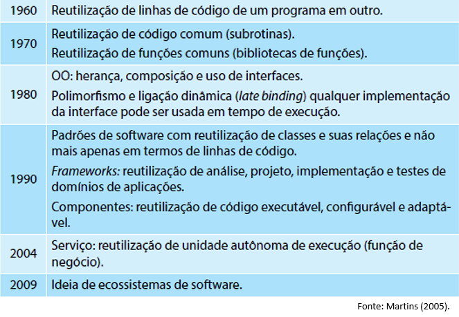
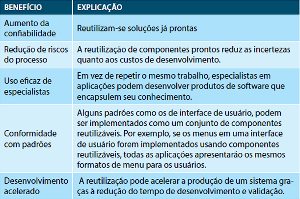
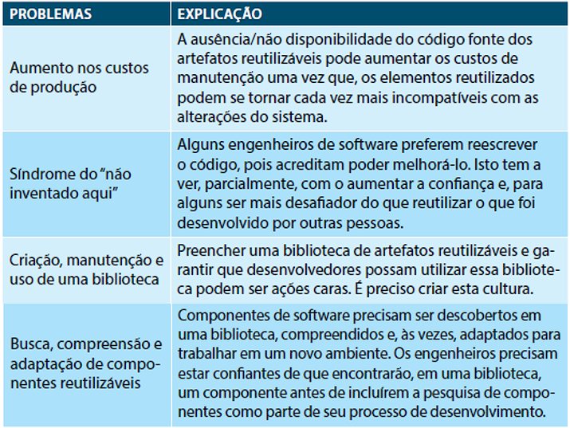
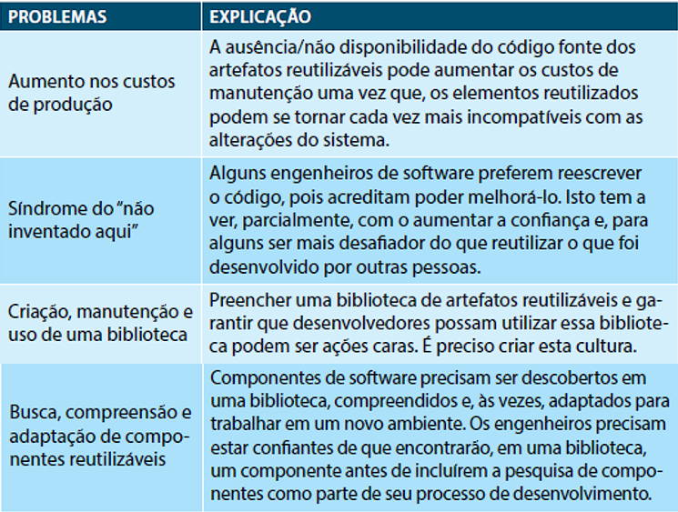

# Tópicos

Reutilização de Software

Vantagens e Desvantagens da Reutilização de Software

# Reutilização de Software

- Os desenvolvedores de software tem buscado por soluções que datam desde quando surgiu o termo Engenharia de Software.

- Dentre as ideias estudadas: tem-se a reutilização de unidades de software resultantes da decomposição de software.

- A noção de reutilização é antiga e teve inicio desde os tempos em que as pessoas começaram a encontrar soluções consistentes para problemas. 

### Qual a motivação? 

Na ideia de que uma vez encontrada a solução, esta poderia ser aplicada a novos problemas.

Na literatura podemos encontrar várias definições para reuso. Vamos conhecer algumas delas:

- **Reutilização** é o uso de qualquer informação disponível que um desenvolvedor pode necessitar no processo de criação de software (Freeman, 1987).

- **Reutilização** é a capacidade de um item de software, previamente desenvolvido, ser usado novamente ou usado repetidamente em parte ou todo, com ou sem modificação (Cooper, 1994). 

- **Reutilização** de software é o processo de criar sistemas de software a partir de softwares existentes ao invés de construí-los do zero (Krueger, 1992).

# Evolução Histórica

# Vantagens e Desvantagens da Reutlização de Software

A mais óbvia: redução dos custos globais de desenvolvimento

Dificuldades da Reutilização 

Para uma efetiva reutilização, é importante que se atenda a alguns requisitos:

1. Existência de uma biblioteca (ou repositório de componentes) Ex.: component source, jars;

2. Garantia de que o componente se comportará conforme foi especificado e que serão confiáveis;

3. Existência de documentação que ajude a compreendê-los e adotá-los. 

