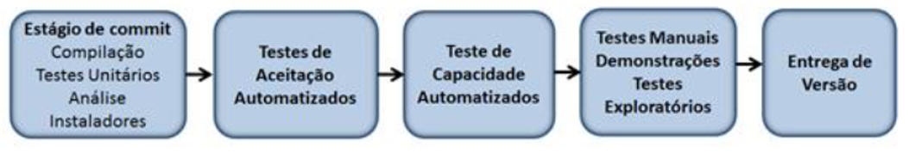
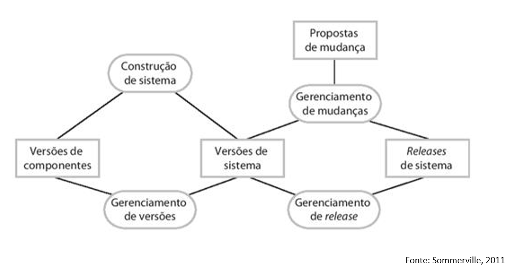
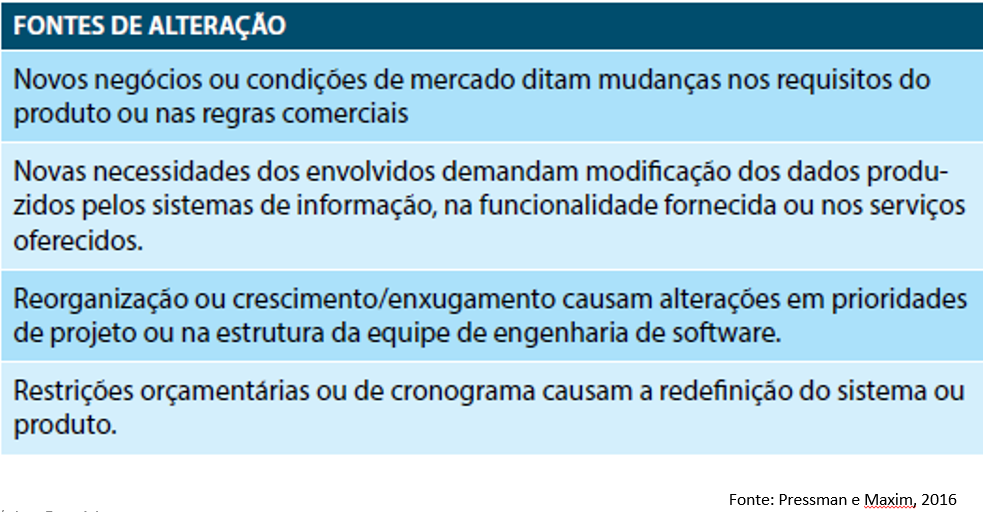
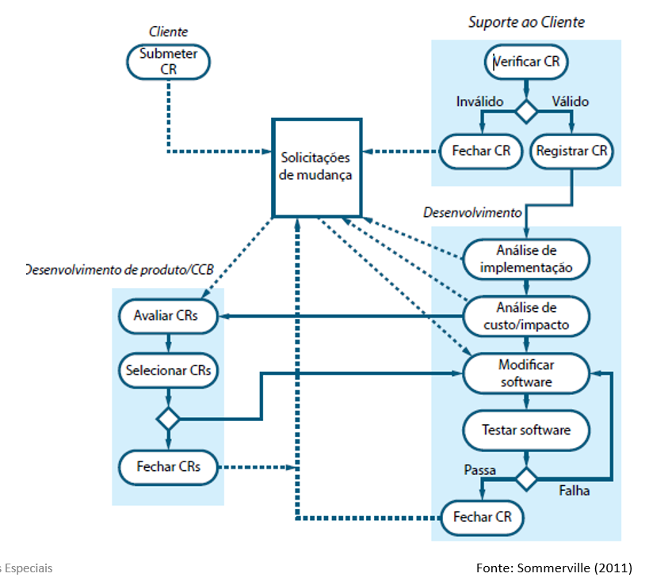
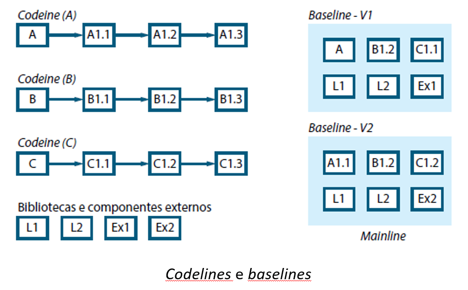
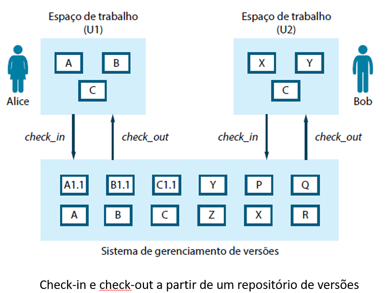
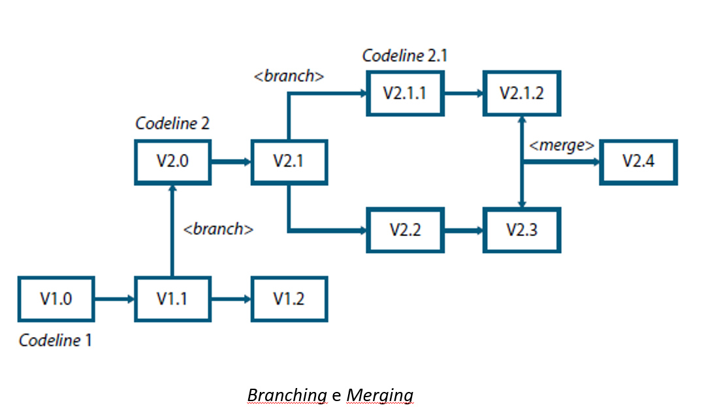
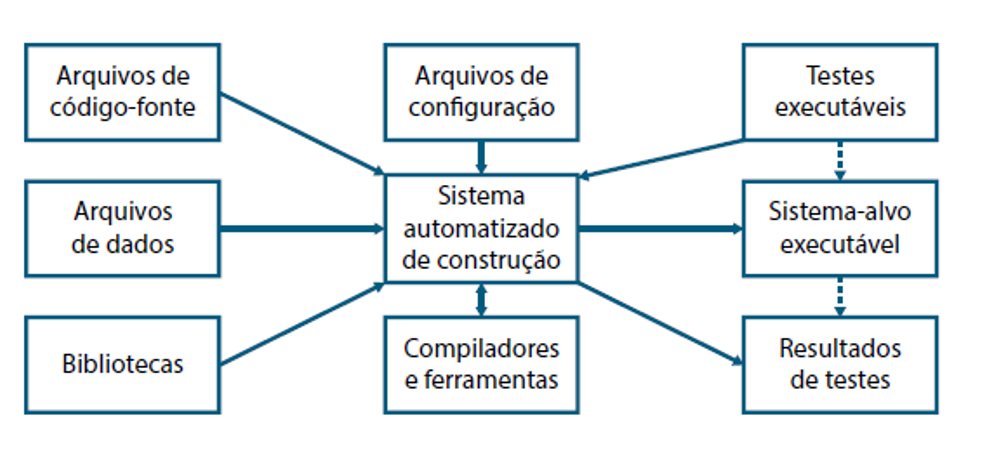

[👈 ](https://github.com/Renanvt/topicos-especiais)

# Tópicos

[O Problema de Entregar Software](#o-problema-de-entregar-software)

[Antipadrões Comuns de Entrega de Versão](#antipadrões-comuns-de-entrega-de-versão)

[Princípios da Entrega de Software](#princípios-da-entrega-de-software)

[Gerenciamento de Configuração de Software (GCS)](#gerenciamento-de-configuração-de-software-gcs)

[Gerenciamento de Mudanças](#gerenciamento-de-mudanças)

[Gerenciamento de Versões](#gerenciamento-de-versões)

[Construção de Sistemas](#construção-de-sistemas)

[Gerencimento de Releases](#gerenciamento-de-releases)

# O Problema de Entregar Software

### Surgem constantes mudanças:

- Cenários
   
- Requisitos 

- Códigos 

- Exigências de entrega de versões rápidas 

- Desenvolvimento de releases em prazos cada vez mais curtos

Mas como otimizar a **entrega de software** sem impactar no orçamento e na qualidade e com prazos cada vez menores? 

Como **entregar** um **sistema confiável** aos usuários, de forma rápida, com poucos riscos e com qualidade? 

Para responder as perguntas: primeiro vamos conhecer os conceitos que envolvem a **Entrega de Software**. 

- A prática de entrega de software é chamada de **Entrega Contínua.** 

- É uma disciplina de desenvolvimento de software, em que você **cria** e **implanta** o software que pode ser **liberado** para **produção** a qualquer momento.

- **Entrega Contínua** (Continuous Delivery) é o processo de implantação contínua em ambiente de produção. 

Integrando continuamente todas as mudanças do software que está sendo desenvolvimento:

- Criação

- Teste 

- Implantação

- Executáveis prontos para liberar para a produção

- **Entrega Contínua**: ativada por uma ferramenta automatizada quando um novo build (versão compilada de um software) for publicado com sucesso no ambiente de homologação. 

- Na **Entrega contínua** não significa que o ambiente de produção é modificado a todo momento -> mas que o ambiente de produção pode ser alterado se um **novo build estiver disponível** e se for **aprovado** para ser **liberado para a produção**.

**OBJETIVO**: encontrar **maneiras** de **entregar** **software com valor** e com **qualidade** de forma eficiente, rápida e confiável.

O que acontece depois da identificação de requisitos, projetos, desenvolvimento e teste de soluções? 

Como fazer desenvolvedores, testadores e pessoal de operação trabalharem juntos de maneira eficiente? 

Tudo isso depende de um **padrão** eficaz -> que vai desde o desenvolvimento do software ate a sua entrega final a produção. 

O **padrão eficaz** que vamos adotar e chamado de **Pipeline de implantação**

- **Pipeline de implantação**: uma implementação automatizada do processo de compilar todas as partes de uma aplicação, implantá-la em um ambiente qualquer – seja de homologação ou produção – testá-la e efetuar sua entrega final. 

- Cada organização tem implementações diferentes de seu *pipeline de implantação* - dependendo de sua cadeia de valor para entregar software.

O **Pipeline de Implantação** funciona resumidamente:

- Cada **mudança** feita na **configuração**, no código fonte, no ambiente ou em dados, cria-se uma **nova instância do pipeline**. 

- O restante do *pipeline* executa uma série de testes para provar que é possível gerar uma entrega de versão. 

- Cada teste na versão candidata (*release candidate*) passa a aumentar a confiança. 

- Se a **versão candidata** passa em todos os testes, pode ser realizada **a entrega de versão**. 

O **Pipeline de Implantação** tem três objetivos:

1. **Torna cada parte do processo** de compilação, implantação, teste e entrega de versão **visível a todos os envolvidos** promovendo a colaboração das equipes. 

2. **Melhora o feedback do processo**, identificando e resolvendo os problemas o mais cedo possível. 

3. **Permite que as equipes entreguem e implantem qualquer versão do software** em qualquer ambiente, a qualquer momento por meio de um processo completamente automatizado. 

O **Pipeline de Implantação** baseia-se no processo de **Integração Contínua**. Não pode haver entrega contínua sem Integração Contínua. 

- **Integração Contínua**: processo de compilar o código em ambiente limpo, executar testes e outros processos de qualidade e gerar um build, disparado por qualquer modificação no código fonte.

- **Implantação Contínua**: processo de promover o build gerado no processo de integração contínua para ambientes intermediários ou para homologação. 

- **Entrega Contínua**: O processo de implantação contínua que busca promover os builds para o ambiente de produção. 

# [👆 TÓPICOS](#tópicos)

# Antipadrões Comuns de Entrega de Versão

- O dia da **entrega de uma nova versão** do sistema tende a ser tenso.

**Por que será que isso acontece?** 

Na maioria dos projetos, isso ocorre em função do risco associado ao processo – que transforma cada entrega em algo assustador. 

- Muitas coisas podem dar errado durante a entrega. 

**O que podemos fazer para evitar esses riscos?** 

- Conhecer quais tipos de falhas no processo podem ser evitados.

**Como fazer isto? Com uma lista de antipadrões comuns.**

### Implantar software manualmente

- **Implantar software manualmente** : documentação extensa, dependência de testes manuais, chamadas frequentes aos desenvolvedores para explicar que algo está errado, correções frequentes no processo de entrega, ambientes com problemas de configuração diferente, entregas de versão que levam mais tempo para executar e entrega de versões imprevisíveis. 

- **Implantar em um ambiente similar ao de produção somente quando o desenvolvimento estiver completo**

- **Gerência de Configuração manual dos ambientes de produção**	

- Entregas de versão: devem ser um processo de baixo risco, barato, rápido, frequente e principalmente previsível. 

As entregas de versão não são assim. 

**O que podemos fazer para melhorar?**

- Usar *Pipelines de Implantação*: combinar com um alto grau de automação de testes e de entrega e gerência de configuração.  

**Com isso**: podemos realizar entregas apertando apenas um botão – em qualquer ambiente necessário, seja de testes, desenvolvimento ou produção.

**Como alcançar os nossos objetivos?** 

Encontrando formas de: 

- **Reduzir o tempo de ciclo** entre uma decisão de fazer uma mudança em um software (uma correção ou a inclusão de uma nova funcionalidade) 

- E o **momento** em que ele **será entregue aos usuários** com alto valor e alta qualidade de maneira eficiente, confiável e rápida.

Para isso: precisamos entregar versões frequentes e automatizadas do software:

- **Automatizadas**: se a entrega não for automatizada, não é passível de repetição. Como os passos são manuais, erros podem aparecer e não existe uma forma de ver o que realmente foi feito. 

- **Frequentes**: entregas de versão frequentes, significa que a variação entre elas é menor e isso reduz os riscos e conduzem a um feedback mais rápido. 

Entregas de versão frequentes e automatizadas: essencial o feedback.  Critérios para o feedback:
 
- **Cada mudança deve disparar um processo de feedback**: podemos dividir um aplicação de software em: código executável, configuração, ambiente de hospedagem e dados. Se cada um deles mudar, o comportamento também poderá mudar. 

- **O feedback deve ser passado o mais rápido possível**. 

**A equipe responsável pela entrega da versão deve receber o feedback e aproveitá-lo.**

# [👆 TÓPICOS](#tópicos)

# Princípios da Entrega de Software

- A **Entrega Contínua** ajuda que o software responda de forma rápida às expectativas dos clientes, aumentando a qualidade dos seus produtos a um baixo custo.

- Podemos dizer que a **Entrega Contínua** é uma prática de entrega de software que exige que se crie e implante o sistema e que este pode ser liberado para produção a qualquer instante. 

- Para isso é necessário **integrar continuamente** as alterações do software em desenvolvimento

A **Entrega de Software** possui princípios que devem ser seguidos para que o processo de entrega da versão seja eficaz. 

**Os princípios de entrega de software:**

1. Criar um processo de confiabilidade e repetitividade de entrega de versão
   
2. Automatize quase tudo
   
3. Mantenha tudo sobre controle de versão
   
4. Se é difícil, faça com mais frequência e amenize o sofrimento
   
5. A qualidade deve estar presente desde o início
   
6. Pronto quer dizer versão entregue
   
7. Todos são responsáveis pelo processo de entrega
   
8. Melhoria Contínua

# [👆 TÓPICOS](#tópicos)

# Gerenciamento de Configuração de Software (GCS)

“A maioria das pessoas que já se envolveu em um projeto de software próximo da data de entrega de versão, sabe o quão estressante o evento pode ser”. 

> Humple e Farley

É uma atividade de apoio destinada a:

- Gerenciar as mudanças.

- Identificar artefatos que precisam ser alterados e as relações entre eles.

- Controle de versão destes artefatos.

- Controle e Auditoria de mudanças e relatar todas as alterações feitas no software. 

**Definição formal**
**Gerência de Configuração** se refere ao processo pelo qual todos os artefatos relevantes ao seu projeto, e as relações entre eles, são armazenados, recuperados, modificados e identificados de maneira única 

Envolve quatro atividades:

1. **Gerenciamento de Mudanças**: acompanhamento das solicitações (clientes e desenvolvedores) por mudanças (custos,  o impacto e se vão ser implementadas)

2. **Gerenciamento de Versões**: acompanhamento de várias versões de componentes (mudanças nos componentes realizadas por diferentes desenvolvedores, não interfiram uma nas outras)

3. **Construção do Sistema**: processo de montagem (componentes, dados, bibliotecas, compilação e ligação) para criar um sistema executável. 

4. **Gerenciamento de Releases**: envolve a preparação de software para o release externo (acompanhamento das versões de sistema que foram liberadas para uso do cliente). 

Relacionamento entre as atividades de **gerenciamento de configuração de software**: 

No processo temos as **alterações** que podem ocorrer a qualquer momento e por qualquer razão. Temos quatro fontes de **alterações fundamentais**:

Terminologias usadas GCS: 

**Item de Configuração (IC)**:  qualquer coisa associada a um projeto de que tenha sido colocado sob controle de configuração. 

- Os ICs normalmente incluem serviços de TI, hardware, software, pessoas e documentações formais, como documentação de processos. 

- **Exemplos de IC**: incluem documentos de requisitos individuais, software, modelos e planos. 

Terminologias usadas GCS: 

- **Controle de Configuração**: controle e garantia das versões de sistemas e componentes. Garante que sejam registradas e mantidas para sejam identificadas e armazenadas por todo o tempo de vida do sistema.	

- **Versão**:  as versões sempre têm um identificador único, o qual é geralmente composto pelo nome do item de configuração mais um número de versão. Têm um identificador único (composto pelo nome do item de configuração + um número de versão).

- **Baseline**: é uma coleção de versões de componentes que compõem um sistema. As *baselines* são controladas: significa que as versões dos componentes que constituem o sistema não podem ser alteradas. 

- **Codeline**: um conjunto de versões de um componente de software e outros itens de configuração dos quais esse componente depende.

- **Mainline**: trata-se de uma sequência de baselines que representam diferentes versões de um sistema. 

- **Branching**: trata-se da criação de uma nova codeline de uma versão em uma codeline existente. A nova codeline e uma codeline existente podem, então, ser desenvolvidas independentemente. 
	
- **Merging**: trata-se da criação de uma nova versão de um componente de software, fundindo versões separadas em diferentes codelines. Essas codelines podem ter sido criadas por um branch anterior de uma das codelines envolvidas. 

- **Release**: Uma versão de um sistema que foi liberada para os clientes (ou outros usuários em uma organização) para uso.

- **Espaço de Trabalho**:  é uma área de trabalho privada em que o software pode ser modificado sem afetar outros desenvolvedores que possam estar usando ou modificando o software.

- **Construção de Sistema**: É a criação de uma versão de sistema executável pela compilação e ligação de versões adequadas dos componentes e bibliotecas que compõem o sistema.

# [👆 TÓPICOS](#tópicos)

# Gerenciamento de Mudanças

Para grandes sistemas a **mudança** é uma realidade. 

Requisitos e as necessidades das empresas mudam durante o ciclo de vida do software, seja por bugs ou porque precisam se adaptar as mudanças do mercado.

Como controlar essas mudanças no sistema? 

**Com um conjunto de processos de Gerenciamento de Mudanças e de ferramentas**

**Gerenciamento de mudanças**: destina-se a garantir que a evolução do sistema seja um processo gerenciado e que seja dada prioridade as mudanças mais urgentes e efetivas.  

Relacionado ao processo de Gerenciamento de Mudanças:

- Análise de custos e benefícios das mudanças solicitadas

- Aprovação dessas mudanças (valem o investimento e o acompanhamento do que foi alterado no sistema)

### Processo de Gerenciamento de Mudanças

# [👆 TÓPICOS](#tópicos)

# Gerenciamento de Versões

Processo de acompanhamento de diferentes versões de componentes de software ou itens de configuração e os sistemas em que esses componentes são usados 

- Também fornece a garantia de que as mudanças feitas por vários desenvolvedores para essas versões não interfiram umas nas outras. 

- O gerenciamento de versões é o processo de gerenciamento de *codelines* e *baselines*.

Os sistemas de gerenciamento de versões normalmente fornecem alguns recursos, como: 

1. Identificação de Versão e Release

2. Gerenciamento de Armazenamento

3. Registro de Histórico de Alterações

4. Desenvolvimento independente

5. Suporte a projetos

# [👆 TÓPICOS](#tópicos)

# Construção de Sistemas

Processo de criação de um sistema completo, executável por meio da construção e ligação dos componentes de sistemas, bibliotecas externa, arquivos de configuração etc.

Deve haver uma comunicação entre as ferramentas de gerenciamento de versões e de construção de sistemas

- **O processo de construção envolve**: realização de check-out de versões de componentes que se encontram no repositório pelo gerenciamento de versões. 

- Também é usada a descrição de configuração que identifica uma baseline.

# [👆 TÓPICOS](#tópicos)

# Gerenciamento de Releases

Um **release** de um sistema: é uma versão de um sistema de software que é distribuída aos clientes. 

Temos dois tipos de releases:

- **Releases principais**:  que fornecem nova e significativa funcionalidade, e o cliente paga por eles. 

- **Releases menores**: que reparam bugs e corrigem os erros relatados pelo cliente. Em geral, eles são distribuídos gratuitamente 

Sobre Sistemas Customizados ou Linhas de Produtos de Software:

- **Releases especiais** do sistema podem precisar ser produzidos para cada cliente e os clientes individuais podem estar executando vários releases diferentes do sistema ao mesmo tempo. 

O que isso significa?  que uma empresa de software vendendo um produto de software especializado pode precisar gerenciar dezenas ou até centenas de diferentes releases desse produto. 

- Se os releases forem muito frequentes ou requerem muitas atualizações de hardware -> clientes podem não quer mudar, porque terão que pagar por eles. 

- Se os releases não forem muito frequentes -> os clientes podem querer mudar para um sistema alternativo.

Muitos **fatores técnicos** e **organizacionais** devem ser levados em consideração ao pensar em **lançar uma nova versão do sistema**

Fatores **técnicos** e **organizacionais** que influenciam o planejamento de **release** de sistema:

- Qualidade técnica do sistema 	
  
- Mudanças de plataforma 	
  
- Quinta Lei de Lehman (adicionar nova funcionalidade pode introduz bugs)
  
- Concorrência 	
  
- Requisitos de Marketing 
  	
- Propostas de mudanças de cliente 	

# [👆 TÓPICOS](#tópicos)

